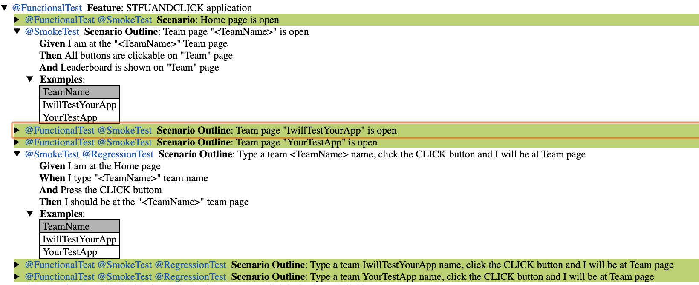
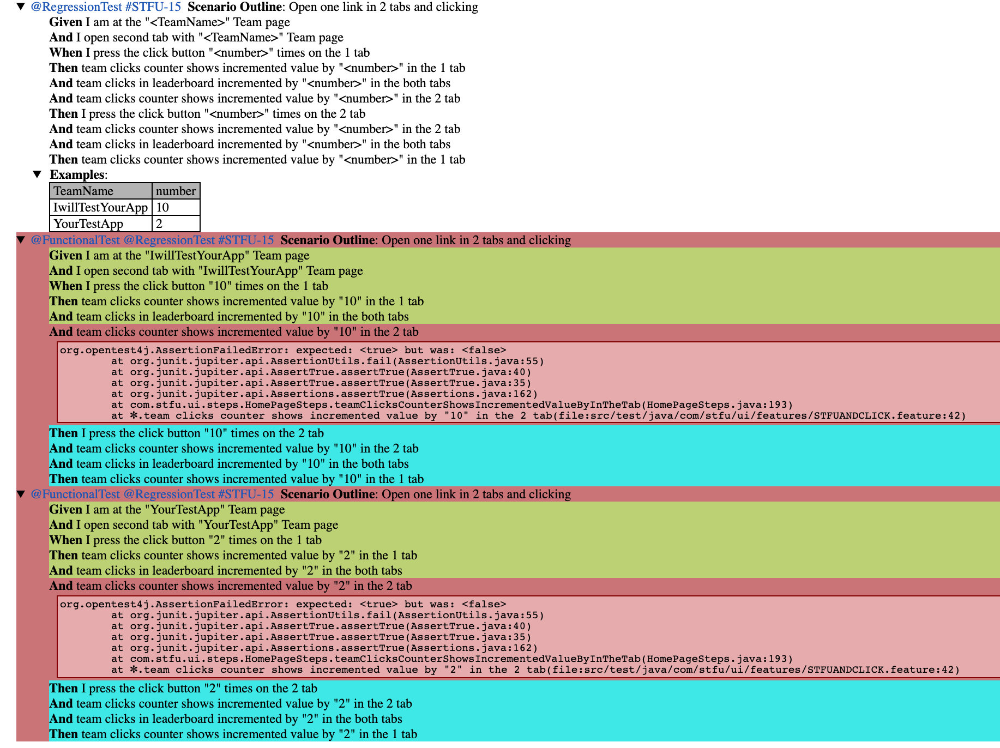
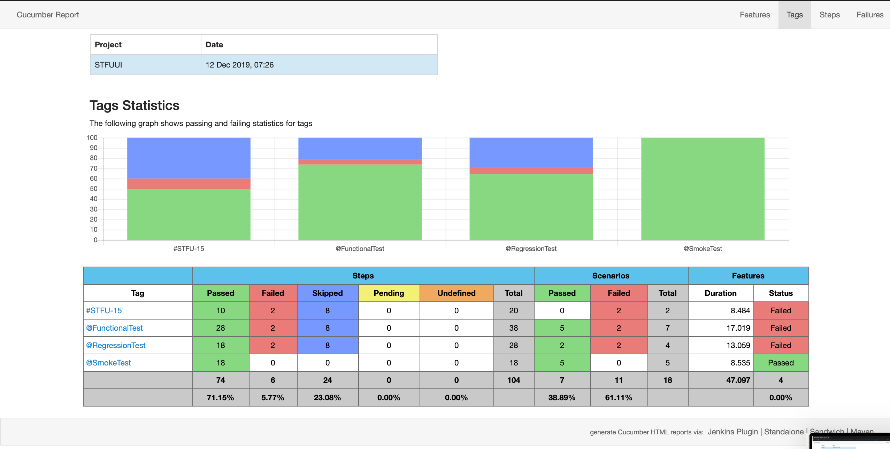
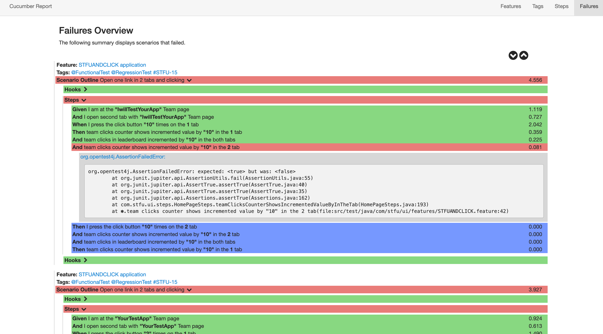

# STFU UI test

Developed in Java with Selenium WebDriver, Cucumber 

### Execution
`mvn test -Dcucumber.options='--tags "@SmokeTest or @RegressionTest"'` 

Available tags: `@RegressionTest` , `@SmokeTest`, `@FunctionalTest`

Also you may run them inside the IDE. Runner has as default `"@SmokeTest or @RegressionTest or @FunctionalTest"` 

##### src/test folder structure:

 `/src/test/java/com/stfu/ui/features` - feature files
 
 `/src/test/java/com/stfu/ui/steps` - steps implementation files
 
 `/src/test/java/com/stfu/ui/page_objects` - Page Object Model, with implementation functions of steps
 
 `/src/test/java/com/stfu/ui/RunTests.java` - test runner 
 
### Generated reports:
* `/target/cucumber/cucumber-html-reports`-  [cucumber-reporting-plugin](https://gitlab.com/monochromata-de/cucumber-reporting-plugin) report
* `/target/cucumber-html-report` - Default Cucumber report 
* `/target/screenshots` -  In case of failed tests, screenshots will be there

)



)




### Configuration
The execution can be configured with system properties 
```
mvn test -Dbrowser=firefox -Dheadless=true
```

Or with a property file `.properties` located in the current context directory - for maven test execution the directory is `/STFUUI/target/test-classes`. 
 

When property value is not provided the default value is used:
```
browser=chrome
headless=true
```

The configuration can change
* `browser` type (`chrome|firefox|edge|ie|safari|opera`) 
* `headless` mode (`true|false`)

Or create run configuration for JUnit and set the "VM options", for example 
``` -ea -Dbrowser=firefox -Dheadless=true```
 
